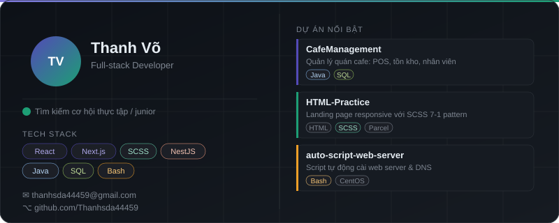

<h1 align="center">Hi there 👋, I'm Thanh Võ</h1>
<h3 align="center">Full-stack Developer &nbsp;·&nbsp; React · Next.js · NestJS · Java</h3>

  
  &nbsp;
  
  &nbsp;
  

---

  

---

## 🛠️ Tech Stack

**Frontend**

**Backend**

**DevOps / Tools**

---

## 📌 Dự Án Nổi Bật

| Dự án | Mô tả | Stack |
|-------|-------|-------|
| [**CafeManagement**](https://github.com/Thanhsda44459/CafeManagement) | Hệ thống quản lý quán cafe: POS, tồn kho, nhân viên | Java · SQL |
| [**HTML-Practice**](https://github.com/Thanhsda44459/HTML-Practice) | Landing page responsive với SCSS 7-1 pattern | HTML · SCSS · Parcel |
| [**auto-script-web-server**](https://github.com/Thanhsda44459/auto-script-web-server) | Script tự động cài web server & cấu hình DNS | Bash · CentOS |

---

## 📊 GitHub Stats

  
  &nbsp;
  

  

---

## 🚀 Đang Phát Triển

- 🔨 Xây dựng ứng dụng full-stack với **React + NestJS**
- 📚 Cải thiện kỹ năng **database design** & **system design**
- 🔍 Tìm kiếm cơ hội **thực tập / junior developer**

---

## 📫 Liên Hệ

  
  &nbsp;
  

